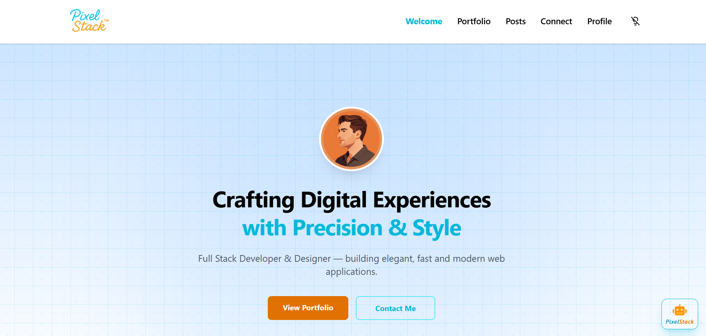
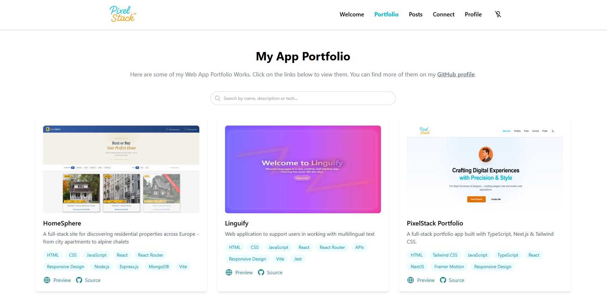
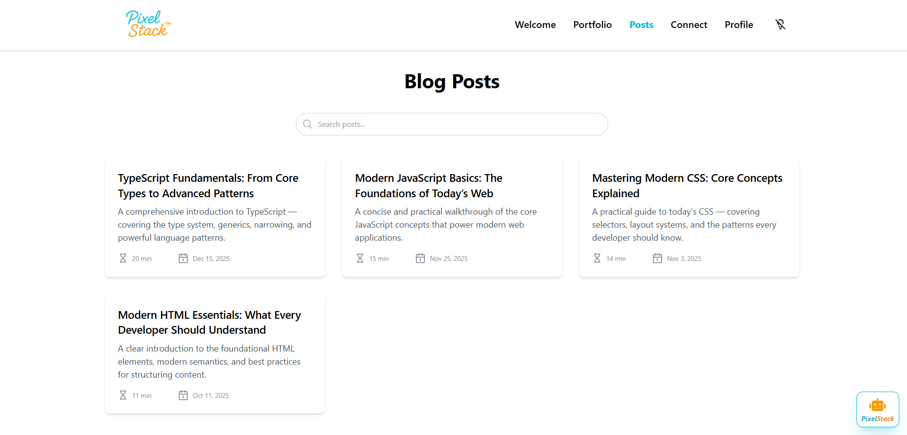
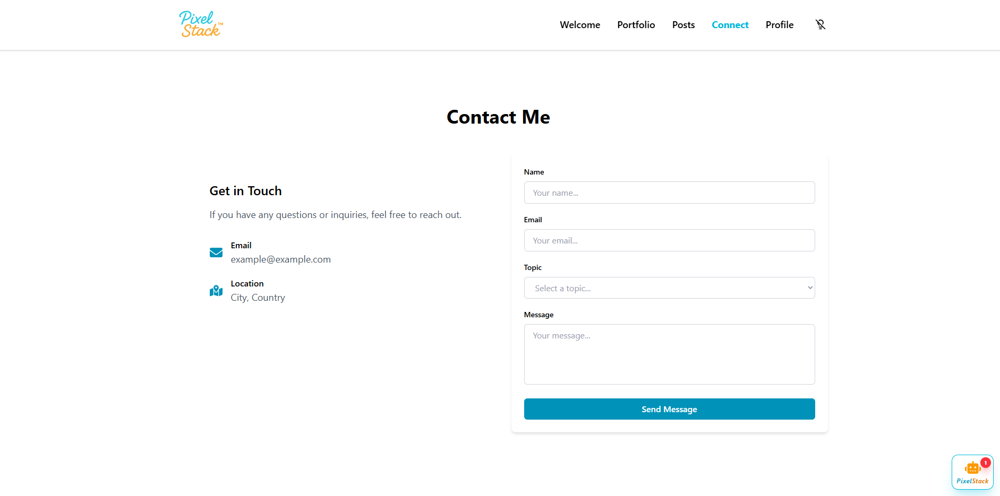
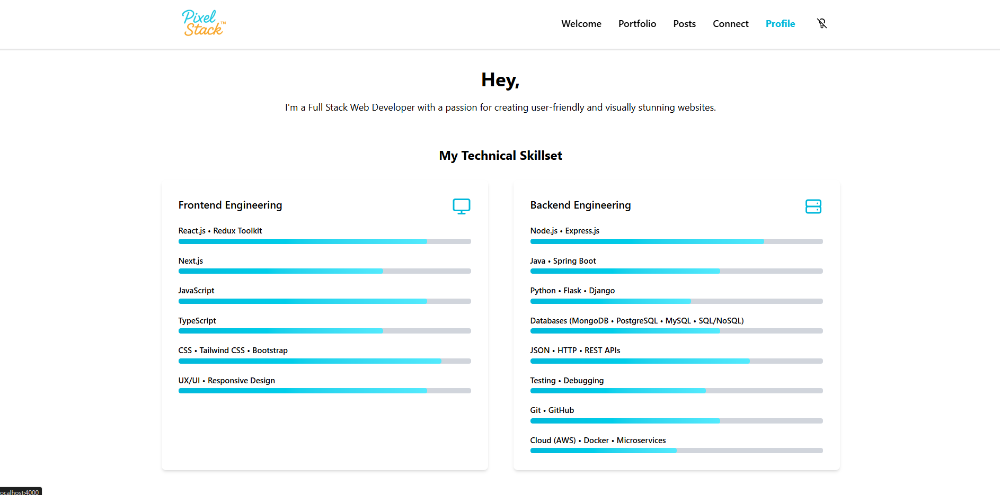
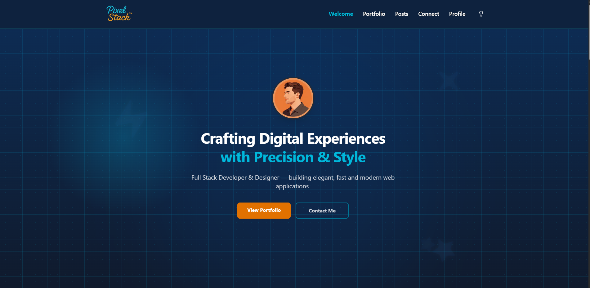
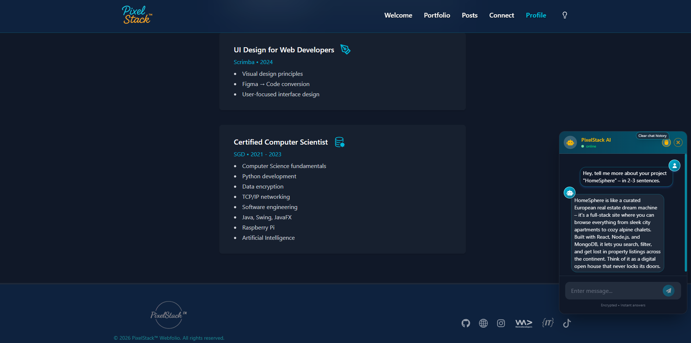
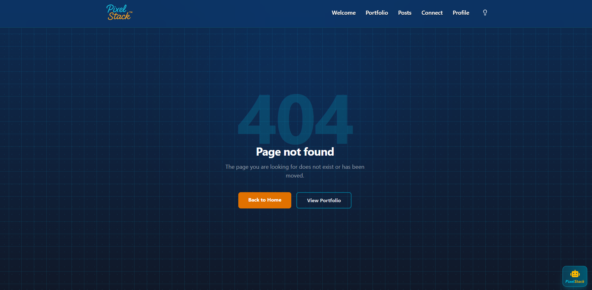

# PixelStack Web Portfolio

[](https://nextjs.org/)
[](https://vercel.com/)
[](https://resend.com/)
[](https://react.dev/)
[](https://www.typescriptlang.org/)
[](https://tailwindcss.com/)
[](https://www.framer.com/motion/)
[](https://react-icons.github.io/react-icons/)
[](https://deepseek.com/)
[]()
[](https://jestjs.io/)
[](https://playwright.dev/)
[](/)
[](https://pixelstack.me)

An animated and responsive portfolio for web apps — built with **Next.js**, **TypeScript**, **React.js**, **Tailwind CSS**, **Framer Motion**, **Resend** and **DeepSeek**.

Comes with: portfolio showcase, blog system, contact form with real email delivery and auto-reply, newsletter subscription with admin notification, search for portfolio and posts, interactive grid hero section with mouse tracking, profile page, dark/light mode and an AI-powered assistant (PixelStack AI) that answers questions about skills, projects, and IT education — and intelligently prefills the contact form based on your intent. All emails delivered via Resend.

## Live Demo

The project is deployed on Vercel and IONOS.

## Preview / Screenshots

<p align="center">

<br />
<em>Homepage with animated hero section</em>
</p>

<p align="center">

<br />
<em>Portfolio page showcasing projects and tech stack</em>
</p>

<p align="center">

<br />
<em>The blog features posts about tech topics</em>
</p>

<p align="center">

<br />
<em>Contact form with API integration and Unread-Badge</em>
</p>

<p align="center">

<br />
<em>Profile & skills section with animated progress bars</em>
</p>

<p align="center">

<br />
<em>Dark mode theme using custom ThemeContext</em>
</p>

<p align="center">

<br />
<em>AI-powered assistant (right side of the screenshot)</em>
</p>

<p align="center">

<br />
<em>404 Not Found Page (dark mode) with PixelStack AI Widget</em>
</p>

## Table of Contents

- [Features](#features)
- [Tech Stack](#tech-stack)
- [Project Structure](#project-structure)
- [AI Assistant](#ai-assistant)
- [Contact Form & Email](#contact-form--email)
- [Newsletter](#newsletter)
- [Interactive Grid](#interactive-grid)
- [Dark Mode](#dark-mode)
- [Testing](#testing)
- [License](#license)

---

## Features

### Modern UI & UX

- Fully responsive layout / Mobile-friendly navigation
- Smooth Framer Motion animations
- Light/Dark mode with custom ThemeContext

### Components & Pages

- **Hero section** with animated intro, persistent grid background and mouse-following spotlight effect
- **Portfolio** with project previews, tech stack, and live links
- **Blog system** with dynamic routes (`/posts/[handle]`)
- **Search bar** filters portfolio items and blog posts by title, keyword in the description or technology
- **Contact form** with real email delivery via Resend (`/api/connect`)
  -> includes client & server-side validation, XSS sanitization, rate limiting and auto-reply to sender
- **Newsletter** subscription with admin email notification via Resend (`/api/newsletter`)
- **PixelStack AI assistant** — floating chat widget powered by DeepSeek, answers questions about skills, projects, tech stack and certifications (`/api/agent`)
- **Contact form prefill** via AI assistant — the AI automatically detects the user's intent and pre-selects the appropriate topic when opening the contact form
- **Mobile navigation** with hamburger menu
- **Footer** with social links and branding
- **Imprint** with privacy policy and legal informations
- **Custom 404 Not Found Page**

### Tech Stack

| Layer           | Technology                              |
| --------------- | --------------------------------------- |
| Framework       | Next.js 16 (App Router)                 |
| Language        | TypeScript 5 (strict mode)              |
| UI              | React 19, Tailwind CSS 4, Framer Motion |
| Icons           | Heroicons, React Icons                  |
| Email           | Resend SDK                              |
| AI Model        | DeepSeek API (OpenAI-compatible)        |
| AI Capabilities | Tool Calling, Intent Detection          |
| Markdown        | react-markdown + remark-gfm             |
| Testing         | Jest, Playwright                        |
| Deployment      | Vercel + IONOS (custom domain)          |

---

## Project Structure

```
📁 pixelstack
│
├── 📂 src
│   ├── 📂 app
│   │   ├── 📂 api
│   │   │   ├── 📂 newsletter       # Newsletter subscription endpoint
│   │   │   ├── 📂 agent           # AI assistant endpoint (DeepSeek)
│   │   │   └── 📂 connect          # Contact form API endpoint with email
│   │   ├── 📂 components           # Reusable UI components
│   │   │   ├── 📂 Agent            # AI assistant chat widget
│   │   │   ├── 📂 Connect          # Contact form (hook + component)
│   │   │   ├── 📂 Footer           # Footer with social links
│   │   │   ├── 📂 Header           # Header + theme toggle
│   │   │   ├── 📂 Home             # Homepage sections
│   │   │   ├── 📂 MessageUI        # Error/success messages
│   │   │   └── 📂 Profile          # About me components
│   │   ├── 📂 portfolio            # Portfolio overview
│   │   ├── 📂 posts                # Blog system
│   │   ├── 📂 profile              # Profile page
│   │   ├── 📂 context              # ThemeContext provider
│   │   ├── 📄 layout.tsx
│   │   ├── 📄 globals.css
│   │   └── 📄 page.tsx             # Homepage
│   │
│   ├── 📂 data                     # Static content
│   │   ├── 📂 content              # Blog post details
│   │   ├── 📄 agentContext.ts      # AI assistant system prompt
│   │   ├── 📄 posts.ts             # Blog metadata
│   │   └── 📄 portfolio.ts         # Portfolio data
│   │
│   ├── 📂 hooks                    # Custom React hooks
│   │   ├── 📄 useAgent.ts          # AI assistant state & fetch logic
│   │   └── 📄 useSearch.ts         # Generic search/filter hook
│   │
│   └── 📂 types                    # TypeScript definitions
│
├── 📂 tests                        # Unit & API tests
│   ├── 📄 useConnectForm.test.ts
│   └── 📄 api-connect.test.ts
│
├── 📂 e2e                          # Playwright E2E tests
│   └── 📄 contact-form.e2e.spec.ts
│
├── 📂 public                       # Static assets
│
├── 📄 jest.config.ts
├── 📄 playwright.config.ts
├── 📄 package.json
└── 📄 README.md
```

---

## AI Assistant

**PixelStack AI** is an AI-powered assistant built into the portfolio as a floating chat widget, visible on every page.

It answers questions about the developer's skills, projects, tech stack, blog posts and certifications — powered by **[DeepSeek](https://deepseek.com)** via an OpenAI-compatible API.

### How it works

The AI assistant uses a structured system prompt (`agentContext.ts`) containing all portfolio data. This context is sent with every request so DeepSeek has full knowledge of the developer's background.

The full conversation history is included in each API call — giving the assistant memory of the current session.

### Contact Form Prefill via Tool Calling

The AI assistant has a powerful feature: intelligent contact form prefill. When a user expresses interest in contacting the developer, the AI automatically detects the intent, calls the prefill_contact_form tool, and opens the contact form with the correct topic pre-selected.

This creates a seamless user experience — instead of manually selecting a topic, the user simply tells the AI what they want, and the form is ready for them.

#### How It Works (Technical)

1. Tool Definition: The AI assistant has access to the prefill_contact_form tool, which accepts a topic parameter (job, project, collaboration, quote, feedback, other).

2. Intent Detection: DeepSeek analyzes the user's message and decides whether to call the tool. If the user expresses intent to contact the developer, the tool is triggered.

3. Navigation: The chat widget receives the toolAction from the API and navigates to /connect?topic=[topic].

4. Form Prefill: The contact form reads the topic from the URL parameter and pre-selects the matching dropdown option, with a visual "Pre-filled" indicator.

#### Examples

| User Says                                          | AI Detects           | Topic Prefilled |
| -------------------------------------------------- | -------------------- | --------------- |
| "Would you like to collaborate on something?"      | Collaboration intent | `collaboration` |
| "How much would a website cost?"                   | Quote request        | `quote`         |
| "I have some feedback about your work"             | Feedback intent      | `feedback`      |
| "I'm hiring developers"                            | Job offer intent     | `job`           |
| "I want you for my project"                        | Project inquiry      | `project`       |
| "Let's work together on open source"               | Collaboration intent | `collaboration` |
| "I want to give you my thoughts on your portfolio" | Feedback intent      | `feedback`      |

#### Example Chat Flow

User: "I really like your portfolio and I have a job opportunity for you. Can we discuss this?"

AI Assistant: "I've just opened the contact form with "Job Offer" pre-selected for you. You can fill in your details and message there, and the developer will receive it directly..."

→ The user is automatically navigated to the contact form with the topic pre-filled.

### AI Assistant Features in Detail

- **Floating chat button** — visible on all pages with smooth animations
- **Proactive behavior** — widget opens automatically with a page-aware message
- **Smart contact form prefill** — automatically selects the right topic based on user intent
- **Unread message badge** — pulsing ring animation when new messages arrive
- **Conversation history** — persisted via `localStorage`, survives page reloads
- **Clear chat button** — reset conversation history with one click
- **Custom styling** — for bold, italic, code blocks and links
- **Animated typing indicator** — bouncing dots while AI responds
- **Auto-scroll** — scrolls to latest message via `useRef`
- **Custom scrollbar** — styled for better UX in messages area
- **Rate limiting** — 1 request per 5 seconds per IP, auto-cleanup
- **Retry-After header** — included on 429 responses, tells clients when to retry
- **Configurable model** — switch via `DEEPSEEK_MODEL` env var
- **Dynamic context** — date, timestamp, session ID per request
- **Markdown rendering** — supports `react-markdown` + `remark-gfm`
- **Markdown link handling** — opens links safely in new tabs
- **Tool tips** — hover tooltips on chat buttons (send, clear, close) for better UX

### Proactive Messages by Page

| Page           | Message                                                                           |
| -------------- | --------------------------------------------------------------------------------- |
| `/` (homepage) | "Hi! I'm PixelStack — ask me anything about this developer's skills or projects." |
| `/portfolio`   | "Want me to explain any of these projects?"                                       |
| `/posts`       | "New developer blog posts will appear here from time to time..."                  |
| `/connect`     | "Need help filling out the contact form?"                                         |
| `/profile`     | "Want to know more about the developer's background or certifications?"           |

### Environment Variables

```bash
DEEPSEEK_API_KEY=sk-xxxxxxxxxxxxxxxxxx
DEEPSEEK_MODEL=deepseek-v4-flash
```

### Example questions

**AI assistant answers to:**

- "What skills do you have?"
- "What projects have you built?"
- "Explain HomeSphere."
- "What certifications do you have?"
- "What is your tech stack?"

**Trigger the pre-filling of the contact form via tool calling**:

- "I want ooffer you a job" → prefills contact form with "Job Offer"
- "How much do you charge?" → prefills contact form with "Quote Request"

## Contact Form & Email

The contact form at `/connect` sends a `POST` request to `/api/connect`.

The API route handles:

- Input validation and XSS sanitization
- Rate limiting (1 request per IP per minute)
- Sending the contact message to the inbox and
- Sending an automatic confirmation email back to the sender

Both emails are delivered via **[Resend](https://resend.com)**. If the auto-reply fails, the request still returns success — the notification to the inbox was already sent.

### Email Templates

Both the notification email (to the admin) and the confirmation email (to the sender) feature a **clean, professional layout** with:

- PixelStack branding
- Name, email and topic field displayed prominently
- Responsive design optimized for all email clients

---

## Newsletter

The newsletter form on the homepage sends a `POST` request to `/api/newsletter`.

The API route handles:

- Email format validation and XSS sanitization
- Rate limiting (1 request per IP per minute)
- Sending an admin notification to the inbox with the subscriber's email and signup date

Delivered via **[Resend](https://resend.com)**.

---

## Interactive Grid

The hero section (`/`) features a multi-layer grid background built entirely with React state and CSS `backgroundImage`.

- Persistent grid always visible
- Color transitions on hover
- Mouse-following radial spotlight effect tracks cursor position via `getBoundingClientRect`
- Secondary dot grid layer adds visual depth

---

## Dark Mode

Dark mode is handled through a custom `ThemeContext`:

- Saves preference in `localStorage`
- Detects system theme on first visit
- Avoids FOUC with a mounted-state check
- Instant theme switching without page reload

---

## Testing

The project includes three layers of tests — unit, API, and E2E browser tests via Playwright:

- Unit Tests: React Hook logic (form state, change handlers, submission)
- API Tests: Route validation, error handling & rate limiting (5 scenarios)
- E2E Tests: Browser flow with Playwright (form fill, submission, validation)

Run tests locally:

```
npm run test        # Unit & API tests (watch mode)
npm run test:run    # Unit & API tests (single run)
npm run test:e2e    # Playwright E2E tests
```

### Results

| Suite                    | Tests  | Status             |
| ------------------------ | ------ | ------------------ |
| Unit (hook logic)        | 4      | ✅ passing         |
| API (backend validation) | 5      | ✅ passing         |
| E2E (browser flow)       | 3      | ✅ passing         |
| **Total**                | **12** | **✅ all passing** |

---

## Upcoming Work

### AI‑Agent (Portfolio Guide)

- Continuous refinement of the AI agent to deliver smarter, faster, more robust automation
- Enhance Tool Calling with additional tools (e.g. project recommendations)
- Improve intent detection for more accurate topic prefill

### More Features Planned

- Language Switcher (EN/DE)

---

## License

This project is private and serves as a personal portfolio.
