# PixelStack Web Portfolio

[](https://nextjs.org/)
[](https://vercel.com/)
[](https://resend.com/)
[](https://www.prisma.io/)
[](https://www.postgresql.org/)
[](https://react.dev/)
[](https://www.typescriptlang.org/)
[](https://tailwindcss.com/)
[](https://www.framer.com/motion/)
[](https://react-icons.github.io/react-icons/)
[](https://deepseek.com/)
[](<>)
[](https://jestjs.io/)
[](https://playwright.dev/)
[](https://sentry.io)
[](https://github.com/wkleus/pixelstack/actions/workflows/ci.yml)
[](/)
[](https://pixelstack.me)

An animated and responsive portfolio for web apps — built with **Next.js**, **TypeScript**, **React.js**, **Tailwind CSS**, **Framer Motion**, **PostgreSQL** (hosted on **Neon**, via **Prisma 7**), **Resend** and **DeepSeek**.

Comes with: portfolio showcase, a **database-backed blog system**, contact form with real email delivery and auto-reply, newsletter subscription with admin notification, search for portfolio and posts, interactive grid hero section with mouse tracking, profile page, dark/light mode and an AI-powered assistant (PixelStack AI) that answers questions about skills, projects, and IT education — and intelligently prefills the contact form based on your intent. All emails delivered via Resend.


## Live Demo

The project is deployed on Vercel and IONOS.

## Preview / Screenshots

<p align="center">
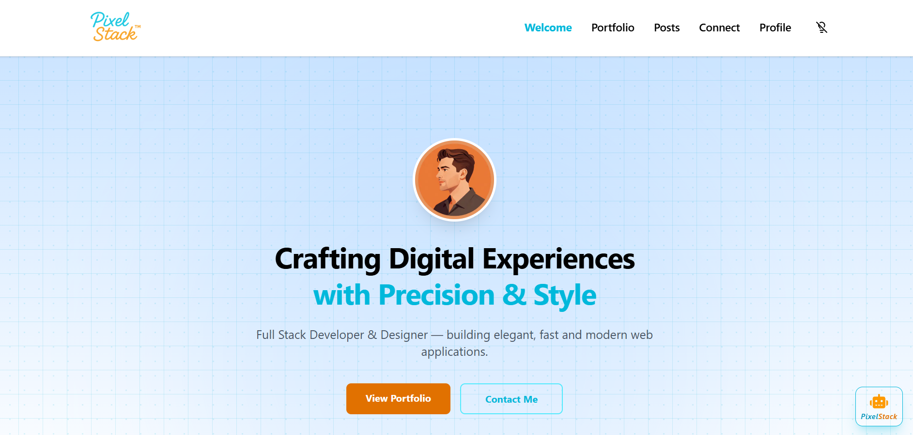
<br />
<em>Homepage with animated hero section</em>
</p>

<p align="center">
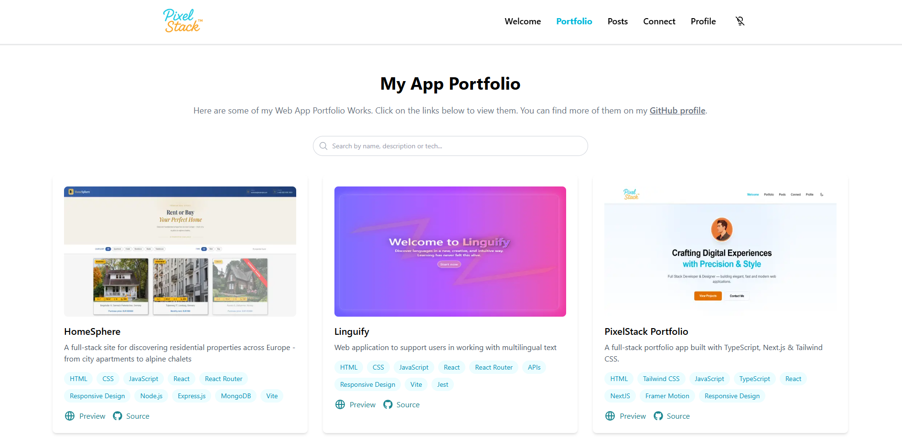
<br />
<em>Portfolio page showcasing projects and tech stack</em>
</p>

<p align="center">
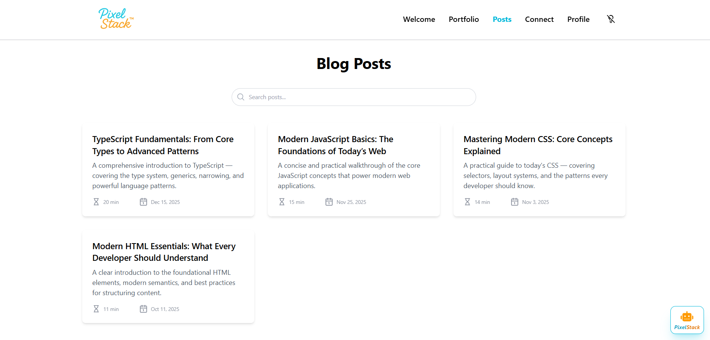
<br />
<em>The blog features posts about tech topics</em>
</p>

<p align="center">
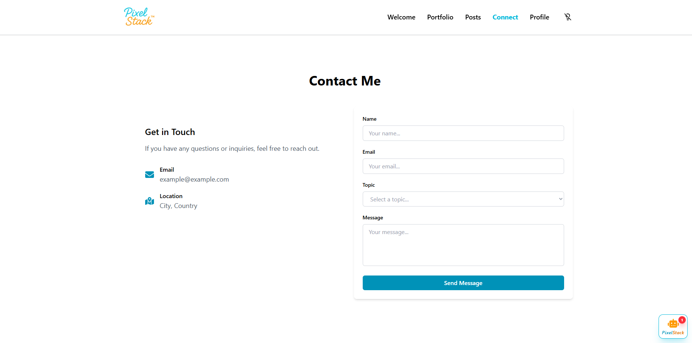
<br />
<em>Contact form with API integration and Unread-Badge</em>
</p>

<p align="center">
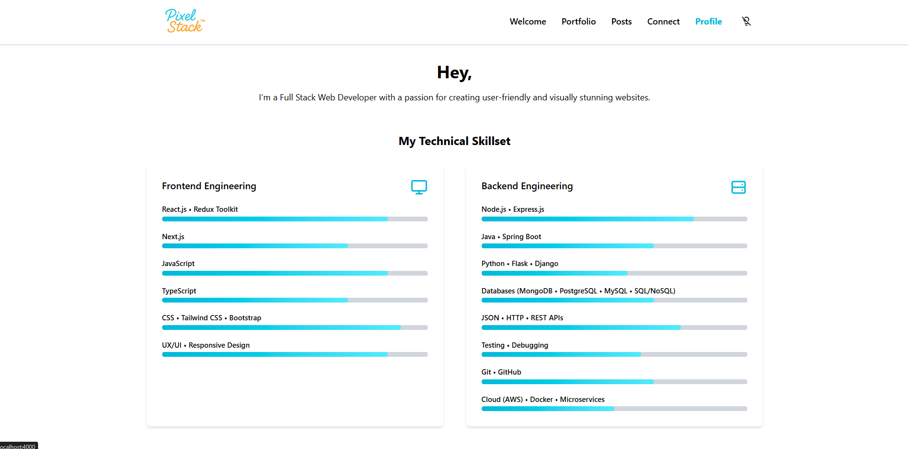
<br />
<em>Profile & skills section with animated progress bars</em>
</p>

<p align="center">
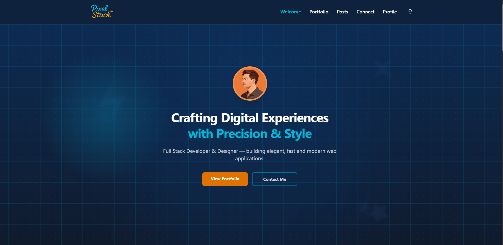
<br />
<em>Dark mode theme using custom ThemeContext</em>
</p>

<p align="center">
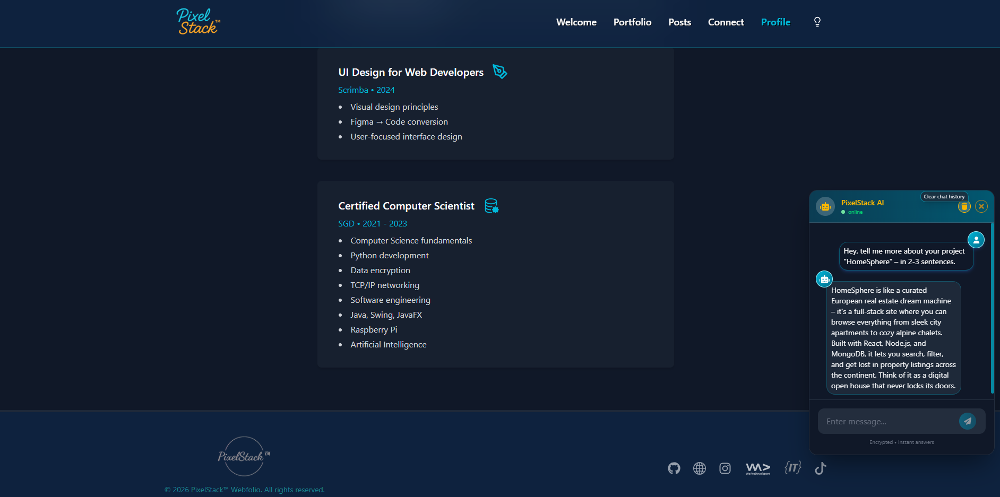
<br />
<em>AI-powered assistant (right side of the screenshot)</em>
</p>

<p align="center">
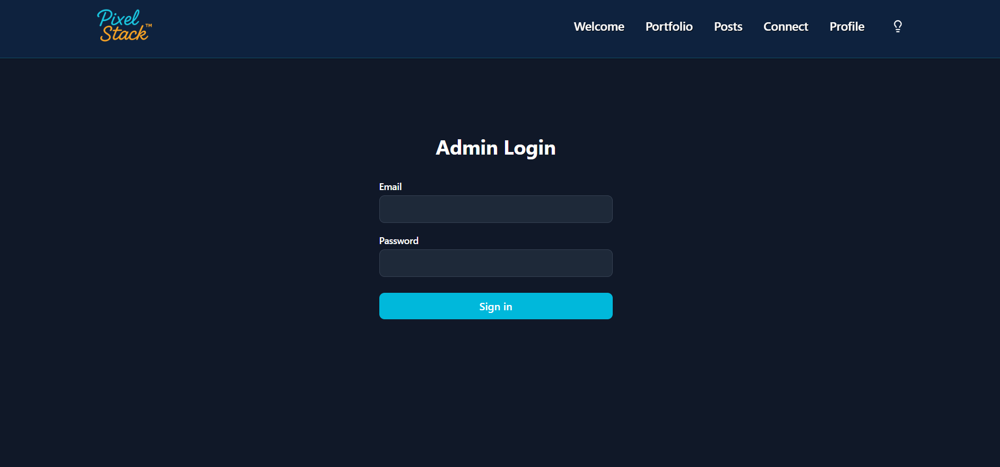
<br />
<em>Admin Login page</em>
</p>

<p align="center">
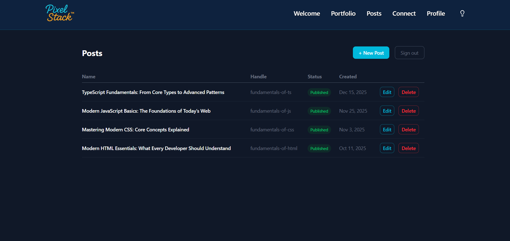
<br />
<em>Admin Dashboard with post management and live Umami visitor stats</em>
</p>

<p align="center">
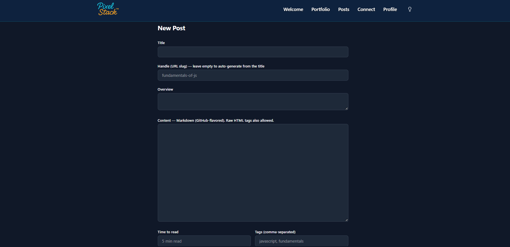
<br />
<em>Form for creating a new post by Admin</em>
</p>

<p align="center">
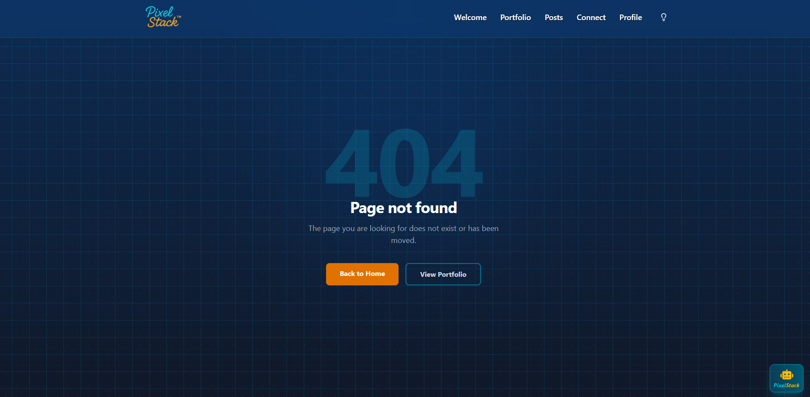
<br />
<em>404 Not Found Page (dark mode) with PixelStack AI Widget</em>
</p>

## Table of Contents

- [Features](#features)
- [Tech Stack](#tech-stack)
- [Project Structure](#project-structure)
- [Blog & Database](#blog--database)
- [Admin Area](#admin-area)
- [AI Assistant](#ai-assistant)
- [Contact Form & Email](#contact-form--email)
- [Newsletter](#newsletter)
- [Interactive Grid](#interactive-grid)
- [Dark Mode](#dark-mode)
- [Testing](#testing)
- [Analytics](#analytics)
- [Error Tracking](#error-tracking)
- [Security Headers](#security-headers)
- [Accessibility & SEO](#accessibility--seo)
- [Environment Variables](#environment-variables)
- [Upcoming Work](#upcoming-work)
- [License](#license)

---

## Features

### Modern UI & UX

- Fully responsive layout / Mobile-friendly navigation
- Smooth Framer Motion animations
- Light/Dark mode with custom ThemeContext

### Components & Pages

- **Hero section** with animated intro, persistent grid background and mouse-following spotlight effect
- **Portfolio** with project previews, tech stack, and live links
- **Blog system** backed by **PostgreSQL** via **Prisma 7**, with dynamic routes (`/posts/[handle]`)
- **Search bar** filters portfolio items and blog posts by title, keyword in the description or technology
- **Contact form** with real email delivery via Resend (`/api/connect`)
  -> includes client & server-side validation, XSS sanitization, rate limiting and auto-reply to sender
- **Newsletter** subscription with admin email notification via Resend (`/api/newsletter`)
- **Admin Login** and **Admin Dashboard** to create, edit, delete blog posts
- **PixelStack AI assistant** — floating chat widget powered by DeepSeek, answers questions about skills, projects, tech stack and certifications (`/api/agent`)
- **Contact form prefill** via AI assistant — the AI automatically detects the user's intent and pre-selects the appropriate topic when opening the contact form
- **Mobile navigation** with hamburger menu
- **Footer** with social links and branding
- **Imprint** with privacy policy and legal information
- **Custom 404 Not Found Page**

### Tech Stack

| Layer            | Technology                                        |
| ---------------- | ------------------------------------------------- |
| Framework        | Next.js 16 (App Router)                           |
| Language         | TypeScript 5 (strict mode)                        |
| UI               | React 19, Tailwind CSS 4, Framer Motion           |
| Icons            | Heroicons, React Icons, Lucide React              |
| Database         | PostgreSQL (hosted on [Neon](https://neon.tech))  |
| ORM              | Prisma 7 (driver adapter via `pg`)                |
| Auth             | Auth.js v5 (Credentials, single admin account)    |
| Password Hashing | bcryptjs                                          |
| Email            | Resend SDK                                        |
| AI Model         | DeepSeek API (OpenAI-compatible)                  |
| AI Capabilities  | Tool Calling, Intent Detection, Streaming (SSE)   |
| Rate Limiting    | Upstash Redis (`@upstash/ratelimit`)              |
| Markdown         | react-markdown + remark-gfm (AI chat widget only) |
| Testing          | Jest, Playwright                                  |
| Analytics        | Self-hosted Umami (Vercel + Neon Postgres)        |
| Error Tracking   | Sentry                                            |
| Security         | CSP, HSTS, X-Frame-Options via `next.config.ts`   |
| Deployment       | Vercel (custom domain via IONOS DNS)              |

---

## Project Structure

```
📁 pixelstack
│
├── 📂 prisma
│   ├── 📂 migrations               # Prisma migration history
│   └── 📄 schema.prisma            # Post model definition
│
├── 📂 scripts
│   ├── 📄 import-posts.ts          # Seeds the DB from src/data/posts.ts
│   ├── 📄 test-db.ts               # Verifies the DB connection
│   └── 📄 hash-password.ts         # Generates ADMIN_PASSWORD_HASH_B64 from a plaintext password
│
├── 📂 src
│   ├── 📂 app
│   │   ├── 📂 admin                # Password-protected post management (see Admin Area)
│   │   │   ├── 📂 adminDashboard   # /admin/adminDashboard — list, sign-out
│   │   │   ├── 📂 login            # /admin/login
│   │   │   ├── 📂 posts
│   │   │   │   ├── 📂 new          # /admin/posts/new
│   │   │   │   ├── 📂 [id]/edit    # /admin/posts/[id]/edit
│   │   │   │   └── 📄 PostForm.tsx # Shared create/edit form (HTML textarea)
│   │   │   └── 📄 actions.ts       # Server Actions: createPost, updatePost, deletePost
│   │   ├── 📂 api
│   │   │   ├── 📂 auth             # Auth.js route handler
│   │   │   ├── 📂 newsletter       # Newsletter subscription endpoint
│   │   │   ├── 📂 agent            # AI assistant endpoint (DeepSeek)
│   │   │   └── 📂 connect          # Contact form API endpoint with email
│   │   ├── 📂 components           # Reusable UI components
│   │   │   ├── 📂 Agent            # AI assistant chat widget
│   │   │   ├── 📂 Connect          # Contact form (hook + component)
│   │   │   ├── 📂 Footer           # Footer with social links (incl. discreet Admin link)
│   │   │   ├── 📂 Header           # Header + theme toggle
│   │   │   ├── 📂 Home             # Homepage sections (Posts.tsx fetches from DB)
│   │   │   ├── 📂 MessageUI        # Error/success messages
│   │   │   └── 📂 Profile          # About me components
│   │   ├── 📂 portfolio            # Portfolio overview
│   │   ├── 📂 posts                # Blog system — pages fetch from PostgreSQL, render stored HTML
│   │   ├── 📂 profile              # Profile page
│   │   ├── 📂 context              # ThemeContext, AgentContext (shared chat state)
│   │   ├── 📄 layout.tsx
│   │   ├── 📄 globals.css
│   │   └── 📄 page.tsx             # Homepage
│   │
│   ├── 📂 data                     # Static content
│   │   ├── 📂 content              # Blog post seed content (used by import-posts.ts)
│   │   ├── 📄 agentContext.ts      # AI assistant system prompt
│   │   ├── 📄 posts.ts             # Blog seed data (imported into PostgreSQL, not read live)
│   │   └── 📄 portfolio.ts         # Portfolio data
│   │
│   ├── 📂 hooks                    # Custom React hooks
│   │   ├── 📄 useAgent.ts          # AI assistant state & fetch logic
│   │   └── 📄 useSearch.ts         # Generic search/filter hook
│   │
│   ├── 📂 lib
│   │   ├── 📄 prisma.ts            # Prisma Client (pg driver adapter)
│   │   └── 📄 posts.ts             # DB access layer for blog posts (incl. admin queries)
│   │
│   ├── 📄 auth.ts                  # Auth.js: Credentials provider, session config
│   ├── 📄 auth.config.ts           # Edge-safe Auth.js config, shared with middleware.ts
│   ├── 📄 middleware.ts            # Route protection for /admin (see Admin Area)
│   │
│   └── 📂 types                    # TypeScript definitions
│
├── 📂 tests                        # Unit & API tests
│   ├── 📄 useConnectForm.test.ts
│   └── 📄 api-connect.test.ts
│
├── 📂 e2e                          # Playwright E2E tests
│   └── 📄 contact-form.e2e.spec.ts
│
├── 📂 public                       # Static assets
│
├── 📄 prisma.config.ts
├── 📄 jest.config.ts
├── 📄 playwright.config.ts
├── 📄 package.json
├── 📂 .github
│   └── 📂 workflows
│       └── 📄 ci.yml               # Lint + unit tests on push/PR
│
├── 📄 instrumentation.ts           # Loads Sentry config per runtime
├── 📄 sentry.client.config.ts
├── 📄 sentry.server.config.ts
├── 📄 sentry.edge.config.ts
└── 📄 README.md
```

---

## Blog & Database

Blog posts are stored in a **PostgreSQL** database (`Post` table) - hosted on **[Neon](https://neon.tech)**, connected via **Vercel's Neon integration** - and served through **Prisma 7**, using the `@prisma/adapter-pg` driver adapter (required since Prisma 7 dropped the bundled Rust query engine). Local development and Vercel production both point at the same Neon database via `DATABASE_URL`.

### Schema

The `Post` model (`prisma/schema.prisma`) includes: `handle` (unique slug), `name`, `overview`, `content` (HTML), `timeToRead`, `createdAt`, `updatedAt`, `published`, and `tags`.

### How pages read the data

`src/lib/posts.ts` centralizes all reads and only ever returns **published** posts:

- `getAllPosts()` — all published posts, newest first (used by `/posts`)
- `getRecentPosts(limit)` — the most recent posts, up to the given limit (used on the homepage)
- `getPostByHandle(handle)` — single post (used by `/posts/[handle]`)
- `getAllPostHandles()` — used by `generateStaticParams`

Pages that display posts (`src/app/posts/page.tsx`, `src/app/posts/[handle]/page.tsx`, `src/app/components/Home/Posts.tsx`) are **Server Components** that fetch via this layer and pass the data down as props to client components handling animation and search.

### Managing content today

Posts are managed through the **[Admin Area](#admin-area)** at `/admin` — no more hand-editing HTML in a database cell. For one-off tweaks or bulk edits, the **[Neon SQL Editor](https://neon.tech/docs/get-started-with-neon/query-with-neon-sql-editor)** or pgAdmin4 (connected to the remote Neon connection string) still work directly against the `Post` table.

`src/data/posts.ts` + `src/data/content/*.ts` remain in the repo purely as the **original seed source** for `scripts/import-posts.ts`; they are no longer read by the live app.

---

## Admin Area

A password-protected area at `/admin/adminDashboard` for creating, editing, deleting and (un)publishing posts — no more editing raw HTML/Markdown in a database cell.

### Authentication

- **[Auth.js v5](https://authjs.dev)** with a **Credentials** provider - single admin account
- The admin identity lives entirely in environment variables: `ADMIN_EMAIL` + `ADMIN_PASSWORD_HASH_B64` (a **Base64-encoded** bcrypt hash - the plaintext password is never stored anywhere).
- Sessions are JWT-based (`session: { strategy: 'jwt' }`), signed with `AUTH_SECRET`.

> **Why Base64 and not the raw bcrypt hash?** A raw hash looks like `$2b$12$abc...` — the `$`-prefixed segments get silently corrupted by `.env` variable expansion and by some shells' quoting rules. Base64 contains no `$` at all, so it survives copy-pasting into `.env` and into Vercel's environment variables intact. `src/auth.ts` decodes it back to the real hash at runtime before comparing.

### Route protection

`/admin/*` is protected in **two independent layers**:

1. **`src/middleware.ts`** — redirects unauthenticated requests before the page even starts rendering, based on the `authorized` callback in `src/auth.config.ts`.
2. **Every protected page itself** (`adminDashboard/page.tsx`, `posts/new/page.tsx`, `posts/[id]/edit/page.tsx`) re-checks the session server-side via `auth()`. Server Actions in `src/app/admin/actions.ts` do the same before touching the database.

### Content format: HTML

- Post `content` is authored directly as **HTML** in a plain `<textarea>` — no rich-text editor needed. It is stored as-is in PostgreSQL and rendered on the public site via `dangerouslySetInnerHTML`, with no Markdown-to-HTML conversion step.

### What the admin area can do

- **`/admin/adminDashboard`** — list all posts (published **and** drafts) with status, handle and creation date, plus a sign-out button
- **`/admin/posts/new`** — create a new post (title, handle/slug — auto-generated from the title if left blank —, overview, HTML content, time-to-read, tags, published toggle)
- **`/admin/posts/[id]/edit`** — edit an existing post, pre-filled with its current values
- **Delete** — with a browser confirmation prompt before submitting
- **`published` toggle** — hide/show a post on the live site without deleting it
- **Live analytics widget** — all-time visitor stats (visitors, visits, views) pulled from the self-hosted Umami instance, shown directly on `/admin/adminDashboard`

Every create/update/delete Server Action calls `revalidatePath()` for the affected routes (`/admin/adminDashboard`, `/posts`, `/`, `/posts/[handle]`).

---

## AI Assistant

**PixelStack AI** is an AI-powered assistant built into the portfolio as a floating chat widget, visible on every page.

It answers questions about the developer's skills, projects, tech stack, blog posts and certifications — powered by **[DeepSeek](https://deepseek.com)** via an OpenAI-compatible API.

### How it works

The AI assistant uses a structured system prompt (`agentContext.ts`) containing all portfolio data. This context is sent with every request so DeepSeek has full knowledge of the developer's background.

The full conversation history is included in each API call — giving the assistant memory of the current session.

### Streaming & Tool Calling Flow

Responses are streamed via **Server-Sent Events (SSE)** for a responsive typing experience.

The model has access to **three tools** (`src/app/api/agent/route.ts`):

- **`prefill_contact_form`** — see [Contact Form Prefill via Tool Calling](#contact-form-prefill-via-tool-calling) below.
- **`get_project_details`** — the system prompt only ships a one-line overview per project (to keep it small and cache-friendly); this tool fetches the full case study (challenges, architecture, tech decisions) for one named project on demand.
- **`get_developer_background`** — likewise fetches the full skills list (with proficiency levels) and/or education & certificate details, which aren't fully spelled out in the base system prompt.
  When the model decides to call a tool:

1. DeepSeek streams tool-call fragments (name + arguments); multiple tools can be called in the same turn.
2. The API accumulates the fragments and executes each tool.
3. If `get_project_details` and/or `get_developer_background` were called, a **second streamed call** is made with the tool results so the model can weave the fetched content into a full answer.
4. If only `prefill_contact_form` was called, a short **non-streamed** follow-up call produces a single confirmation sentence instead (the tool's own instructions forbid adding project details or questions there).
5. A special `tool_action` SSE event carries the topic to the client; the chat widget navigates to `/connect?topic=...` and the form pre-selects it. This event is still sent even when `prefill_contact_form` was called alongside a content tool in the same turn.
   This keeps the UI snappy while still allowing reliable, potentially multi-step tool execution.

### Contact Form Prefill via Tool Calling

The AI assistant has a powerful feature: intelligent contact form prefill. When a user expresses interest in contacting the developer, the AI automatically detects the intent, calls the prefill_contact_form tool, and opens the contact form with the correct topic pre-selected.

This creates a seamless user experience — instead of manually selecting a topic, the user simply tells the AI what they want, and the form is ready for them.

#### How It Works (Technical)

1. Tool Definition: The AI assistant has access to the prefill_contact_form tool, which accepts a topic parameter (job, project, collaboration, quote, feedback, other).
2. Intent Detection: DeepSeek analyzes the user's message and decides whether to call the tool. If the user expresses intent to contact the developer, the tool is triggered.
3. Navigation: The chat widget receives the toolAction from the API and navigates to /connect?topic=[topic].
4. Form Prefill: The contact form reads the topic from the URL parameter and pre-selects the matching dropdown option, with a visual "Pre-filled" indicator.

#### Examples

| User Says                                          | AI Detects           | Topic Prefilled |
| -------------------------------------------------- | -------------------- | --------------- |
| "Would you like to collaborate on something?"      | Collaboration intent | `collaboration` |
| "How much would a website cost?"                   | Quote request        | `quote`         |
| "I have some feedback about your work"             | Feedback intent      | `feedback`      |
| "I'm hiring developers"                            | Job offer intent     | `job`           |
| "I want you for my project"                        | Project inquiry      | `project`       |
| "Let's work together on open source"               | Collaboration intent | `collaboration` |
| "I want to give you my thoughts on your portfolio" | Feedback intent      | `feedback`      |

#### Example Chat Flow

User: "I really like your portfolio and I have a job opportunity for you. Can we discuss this?"

AI Assistant: "I've just opened the contact form with "Job Offer" pre-selected for you. You can fill in your details and message there, and the developer will receive it directly..."

→ The user is automatically navigated to the contact form with the topic pre-filled.

### AI Assistant Features in Detail

- **Floating chat button** — visible on all pages with smooth animations
- **Proactive behavior** — widget opens automatically with a page-aware message
- **Smart contact form prefill** — automatically selects the right topic based on user intent
- **Unread message badge** — pulsing ring animation when new messages arrive
- **Conversation history** — persisted via `localStorage`, survives page reloads
- **Clear chat button** — reset conversation history with one click
- **Custom styling** — for bold, italic, code blocks and links
- **Animated typing indicator** — bouncing dots while AI responds
- **Auto-scroll** — scrolls to latest message via `useRef`
- **Custom scrollbar** — styled for better UX in messages area
- **Rate limiting** — 1 request per 5 seconds per IP, auto-cleanup
- **Retry-After header** — included on 429 responses, tells clients when to retry
- **Configurable model** — switch via `DEEPSEEK_MODEL` env var
- **Dynamic context** — date, timestamp, session ID per request
- **Markdown rendering** — supports `react-markdown` + `remark-gfm`
- **Markdown link handling** — opens links safely in new tabs
- **Tool tips** — hover tooltips on chat buttons (send, clear, close) for better UX

### Proactive Messages by Page

| Page           | Message                                                                           |
| -------------- | --------------------------------------------------------------------------------- |
| `/` (homepage) | "Hi! I'm PixelStack — ask me anything about this developer's skills or projects." |
| `/portfolio`   | "Want me to explain any of these projects?"                                       |
| `/posts`       | "New developer blog posts will appear here from time to time..."                  |
| `/connect`     | "Need help filling out the contact form?"                                         |
| `/profile`     | "Want to know more about the developer's background or certifications?"           |

### Example questions

**AI assistant answers to:**

- "What skills do you have?"
- "What projects have you built?"
- "Explain HomeSphere."
- "What certifications do you have?"
- "What is your tech stack?"
  **Trigger the pre-filling of the contact form via tool calling**:

- "I want to offer you a job" → prefills contact form with "Job Offer"
- "How much do you charge?" → prefills contact form with "Quote Request"

## Contact Form & Email

The contact form at `/connect` sends a `POST` request to `/api/connect`.

The API route handles:

- Input validation and XSS sanitization
- Rate limiting (1 request per IP per minute)
- Sending the contact message to the inbox and
- Sending an automatic confirmation email back to the sender

Both emails are delivered via **[Resend](https://resend.com)**. If the auto-reply fails, the request still returns success — the notification to the inbox was already sent.

### Email Templates

Both the notification email (to the admin) and the confirmation email (to the sender) feature a **clean, professional layout** with:

- PixelStack branding
- Name, email and topic field displayed prominently
- Responsive design optimized for all email clients

---

## Newsletter

The newsletter form on the homepage sends a `POST` request to `/api/newsletter`.

The API route handles:

- Email format validation and XSS sanitization
- Rate limiting (1 request per IP per minute)
- Sending an admin notification to the inbox with the subscriber's email and signup date

Delivered via **[Resend](https://resend.com)**.

---

## Interactive Grid

The hero section (`/`) features a multi-layer grid background built entirely with React state and CSS `backgroundImage`.

- Persistent grid always visible
- Color transitions on hover
- Mouse-following radial spotlight effect tracks cursor position via `getBoundingClientRect`
- Secondary dot grid layer adds visual depth

---

## Dark Mode

Dark mode is handled through a custom `ThemeContext`:

- Saves preference in `localStorage`
- Detects system theme on first visit
- Avoids FOUC with a mounted-state check
- Instant theme switching without page reload

---

## Testing

The project includes three layers of tests — unit, API, and E2E browser tests via Playwright:

- Unit Tests: React Hook logic (form state, change handlers, submission)
- API Tests: Route validation, error handling & rate limiting (5 scenarios)
- E2E Tests: Browser flow with Playwright (form fill, submission, validation)

Run tests locally:

```
npm run test        # Unit & API tests (watch mode)
npm run test:run    # Unit & API tests (single run)
npm run test:e2e    # Playwright E2E tests
```

### Results

| Suite                    | Tests  | Status             |
| ------------------------ | ------ | ------------------ |
| Unit (hook logic)        | 4      | ✅ passing         |
| API (backend validation) | 5      | ✅ passing         |
| E2E (browser flow)       | 3      | ✅ passing         |
| **Total**                | **12** | **✅ all passing** |

---

## Analytics

Visitor analytics are tracked via a **self-hosted [Umami](https://umami.is)** instance, deployed separately on Vercel with its own PostgreSQL database (hosted on Neon).

Since `pixelstack.me` (IONOS) is a custom domain pointing to the same Vercel deployment — not a separate hosting environment — a single tracking script in `layout.tsx` captures visits across both the custom domain and the `.vercel.app` URL under one unified dashboard.

- Privacy-focused, cookie-free tracking (no cookie consent banner required)
- Self-hosted, so visitor data stays fully under my own control
- Tracks visitors, page views, sessions, and referrers in real time
- All-time visitor stats are also surfaced directly in the admin dashboard via a server-side widget that authenticates against Umami's login endpoint (self-hosted Umami has no persistent API keys)

> **Note:** Live visitor stats (all-time visitors / visits / views) are only visible inside the **Admin Dashboard** (`/admin/adminDashboard`). There is no public Umami dashboard link.

---

## Error Tracking

Runtime errors are tracked via **[Sentry](https://sentry.io)**, wired into all three Next.js runtimes:

- Client-side errors (`sentry.client.config.ts`)
- Server-side errors from API routes, e.g. `/api/connect`, `/api/agent` (`sentry.server.config.ts`)
- Edge runtime errors from `src/middleware.ts` (`sentry.edge.config.ts`)
- Unhandled request errors are captured centrally via `instrumentation.ts`

Sentry is disabled outside of `NODE_ENV=production` to keep local/CI noise out of the dashboard.

---

## Security Headers

`next.config.ts` sets a focused set of HTTP security headers on every route:

- **`X-Frame-Options: DENY`** — blocks the site from being embedded in an `<iframe>` (protects `/admin` from clickjacking)
- **`X-Content-Type-Options: nosniff`** — prevents MIME-type sniffing
- **`Strict-Transport-Security`** — enforces HTTPS for one year (including subdomains)
- **`Content-Security-Policy`** — restricts scripts, styles, images and connections to `'self'` plus the two third-party origins actually used (Umami analytics + Sentry). `'unsafe-eval'` is only allowed in development.

---

## Accessibility & SEO

### Accessibility

- Semantic HTML and native interactive elements throughout
- `aria-label` on icon-only controls (theme toggle, chat widget, mobile menu …)
- `aria-invalid` on contact form fields tied to real-time validation
- `aria-live="polite"` / `"assertive"` on success/error messages
- `aria-current="page"` in navigation, `aria-hidden="true"` on decorative elements

### SEO

- Open Graph metadata (title, description, type) globally and per blog post via `generateMetadata`
- `metadataBase` configured for correct absolute URLs in social previews

---

## Environment Variables

Create a `.env.local` (or set the values in the Vercel dashboard).
**Never commit real secrets.**

### Required

| Variable                   | Description                                                              |
| -------------------------- | ------------------------------------------------------------------------ |
| `DATABASE_URL`             | Neon PostgreSQL connection string                                        |
| `AUTH_SECRET`              | Secret used by Auth.js to sign JWT sessions                              |
| `ADMIN_EMAIL`              | Email address of the single admin account                                |
| `ADMIN_PASSWORD_HASH_B64`  | Base64-encoded bcrypt hash of the admin password (see explanation below) |
| `RESEND_API_KEY`           | Resend API key                                                           |
| `RESEND_FROM`              | Verified sender address (e.g. `PixelStack <noreply@yourdomain.com>`)     |
| `RESEND_TO`                | Inbox that receives contact form & newsletter notifications              |
| `DEEPSEEK_API_KEY`         | DeepSeek API key                                                         |
| `UPSTASH_REDIS_REST_URL`   | Upstash Redis REST URL (used for rate limiting)                          |
| `UPSTASH_REDIS_REST_TOKEN` | Upstash Redis REST token                                                 |

### Optional

| Variable                        | Description                                                                                                            |
| ------------------------------- | ---------------------------------------------------------------------------------------------------------------------- |
| `DEEPSEEK_MODEL`                | Model name (default: `deepseek-v4-flash`)                                                                              |
| `STREAM_CHARS_PER_SECOND`       | Throttles AI streaming speed (chars/sec) in development only; ignored in production (default: `0`, i.e. no throttling) |
| `NEXT_PUBLIC_SENTRY_DSN`        | Sentry DSN (client-side error tracking)                                                                                |
| `NEXT_PUBLIC_IONOS_WEBSITE`     | Base URL used for `metadataBase` / Open Graph                                                                          |
| `NEXT_PUBLIC_EMAIL`             | Public contact email shown in the UI (e.g. footer)                                                                     |
| `NEXT_PUBLIC_LOCATION`          | Public location string shown in the UI                                                                                 |
| `AGENT_CONTEXT_1` … `_4`        | Production system prompt for the AI (split because of length limits)                                                   |
| `UMAMI_API_URL`                 | Base URL of the self-hosted Umami instance (used by the admin dashboard's analytics widget)                            |
| `UMAMI_USERNAME`                | Umami login username (self-hosted Umami has no persistent API keys, so the app logs in per request)                    |
| `UMAMI_PASSWORD`                | Umami login password                                                                                                   |
| `UMAMI_WEBSITE_ID`              | Website ID inside Umami whose stats should be shown                                                                    |
| `NEXT_PUBLIC_IMPRESSUM_NAME`    | Legal name shown on `/imprint`                                                                                         |
| `NEXT_PUBLIC_IMPRESSUM_STREET`  | Street address shown on `/imprint`                                                                                     |
| `NEXT_PUBLIC_IMPRESSUM_CITY`    | City shown on `/imprint`                                                                                               |
| `NEXT_PUBLIC_IMPRESSUM_COUNTRY` | Country shown on `/imprint`                                                                                            |
| `NEXT_PUBLIC_IMPRESSUM_EMAIL`   | Contact email shown on `/imprint`                                                                                      |
| `NEXT_PUBLIC_IMPRESSUM_PHONE`   | Phone number for `/imprint` (currently unused — commented out in the page)                                             |

> **Note:** the `Content-Security-Policy` in `next.config.ts` currently allows scripts/connections only to `pixelstack.me`'s Umami instance and Sentry — if you self-host Umami at a different origin, update the CSP in `next.config.ts` accordingly.

> **Why Base64 for the admin password hash?**
> A raw bcrypt hash contains `$` characters that get corrupted by `.env` expansion and some shells. Base64 is safe to copy-paste into `.env` and Vercel. The hash is decoded back at runtime in `src/auth.ts`.

> In **development** the AI system prompt is read from `agent-prompt.txt`
> (this file is gitignored and never committed).
> In **production** it is assembled from the `AGENT_CONTEXT_*` environment variables.

---

## Upcoming Work

### AI‑Agent (Portfolio Guide)

- Continuous refinement of the AI agent to deliver smarter, faster, more robust automation
- Enhance Tool Calling with additional tools (e.g. project recommendations)
- Improve intent detection for more accurate topic prefill

### More Features Planned

- Language Switcher (EN/DE)
- `sitemap.xml` + `robots.txt` for search engine indexing
- Open Graph preview images for richer social media link previews

---

## License

This project is private and serves as a personal portfolio.
